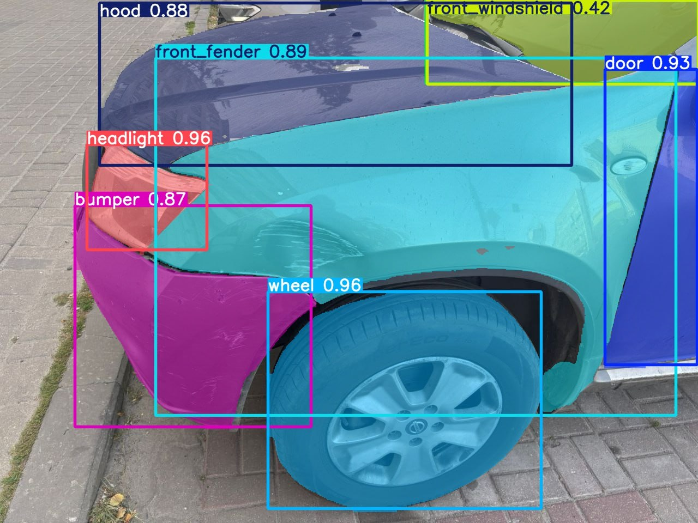
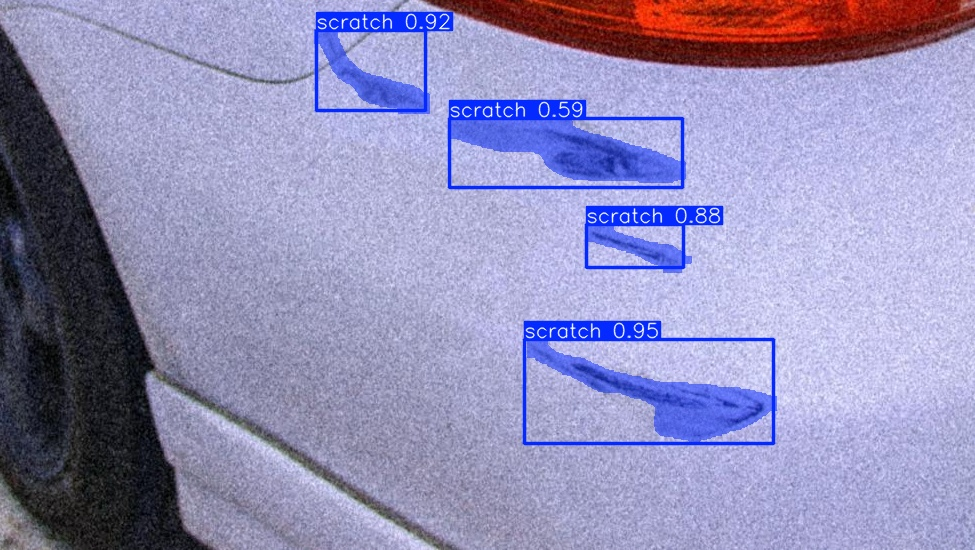
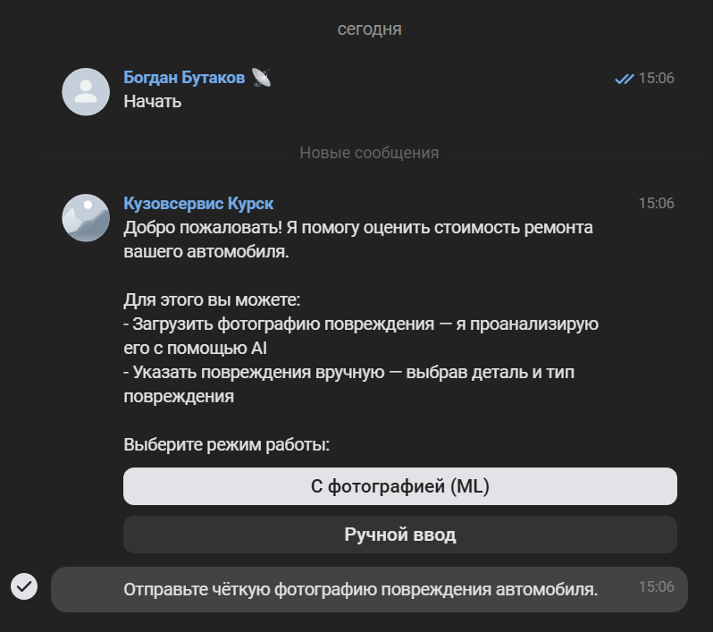
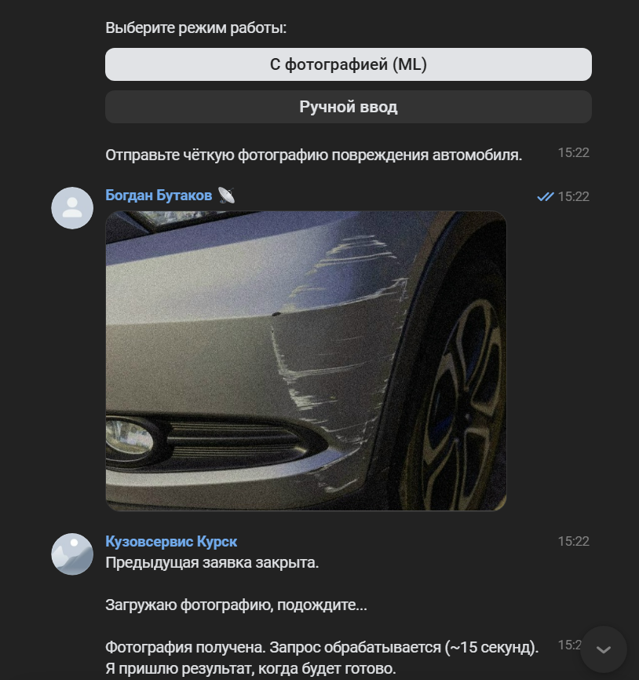
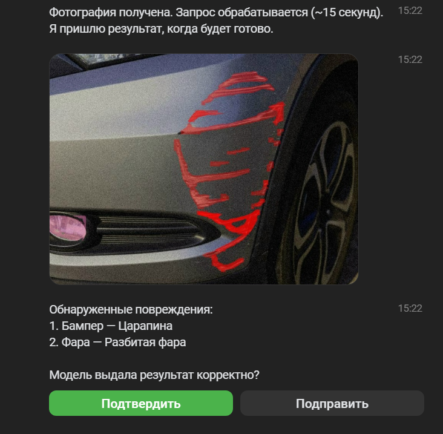
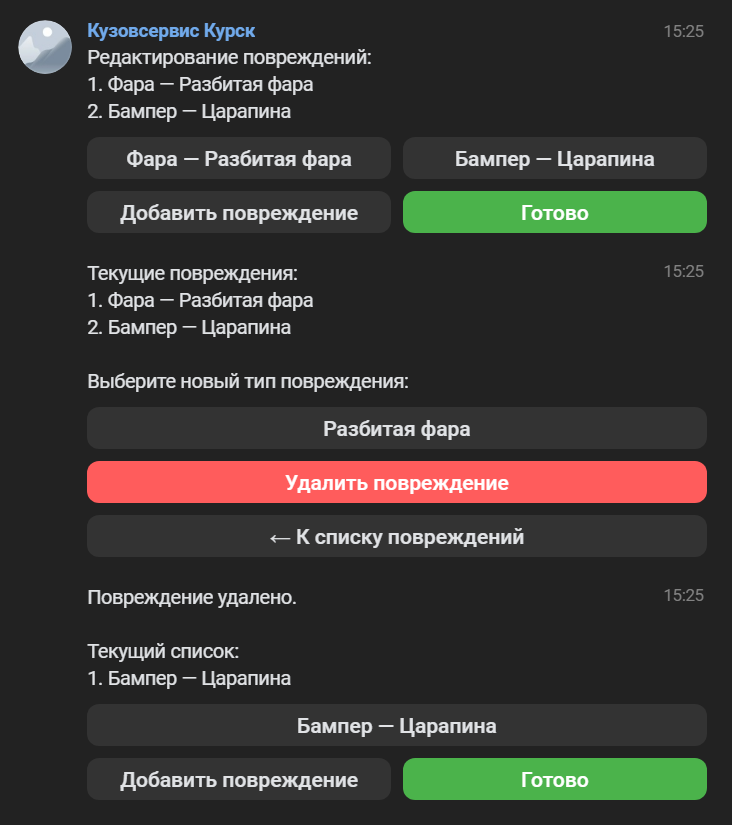
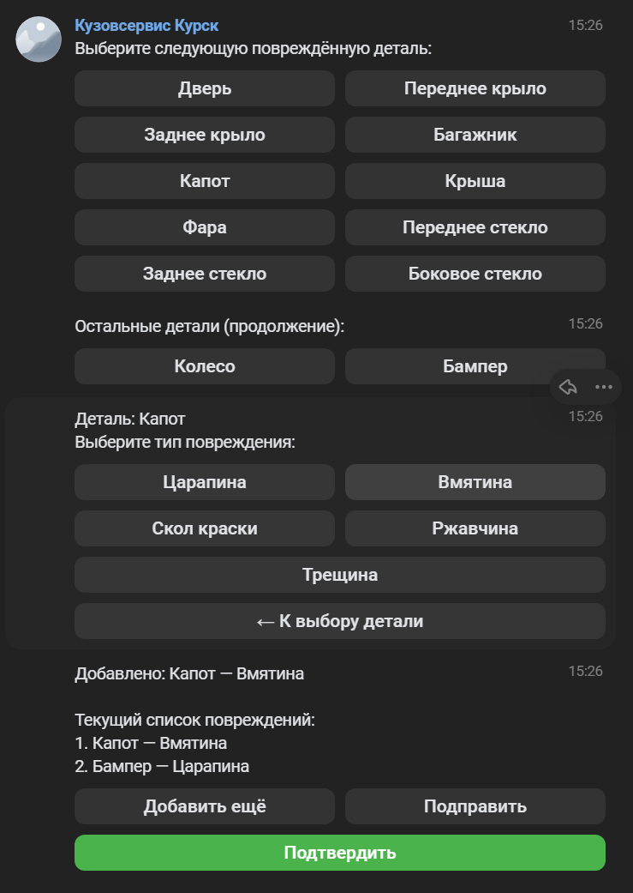
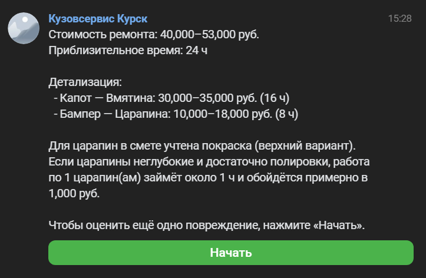

# AutoRepairEstimator

> Система автоматизированной предварительной оценки стоимости ремонта повреждённых автомобилей — выпускная квалификационная работа (бакалавриат).

## Актуальность

Рост количества фото-обращений клиентов в автосервисах создаёт нагрузку на сотрудников: каждую заявку нужно вручную просмотреть, определить повреждения и рассчитать стоимость работ. Методы компьютерного зрения и глубокого обучения позволяют автоматизировать этот процесс. Разработанная система сокращает время обработки одного обращения на **29 минут**.

## Описание

Пользователь отправляет фото повреждённого автомобиля через VK-бот. Система автоматически обнаруживает детали кузова и типы повреждений с помощью двух моделей **YOLOv8-seg**, накладывает маски сегментации и возвращает предварительную оценку стоимости и длительности ремонта. Пользователь может скорректировать список обнаруженных повреждений перед финальным расчётом. Предусмотрен ручной режим — выбор повреждений через меню без анализа фото.

---

## Стек технологий

**ML и инференс**


**Backend**


**Хранилища, инфраструктура**


**Бот, тестирование, CI/CD**

-0077FF?style=flat&logo=vk&logoColor=white)


---

## Структура репозитория

```
AutoRepairEstimator/
├── src/auto_repair_estimator/
│   ├── backend/       # FastAPI-сервис: API, бизнес-логика, адаптеры к БД и Kafka
│   ├── bot/           # VK-бот: обработчики сообщений, клавиатуры, отправка результатов
│   └── ml_worker/     # ML-воркер: инференс YOLOv8-seg, публикация результатов в Kafka
├── ml/                # Скрипты и обучение моделей
├── docker/            # Dockerfile'ы, docker-compose.yml, init.sql
├── tests/             # Юнит- и интеграционные тесты
├── scripts/           # Вспомогательные скрипты (нагрузочное тестирование и др.)
├── docs/              # Архитектурные диаграммы
└── .github/workflows/ # CI/CD пайплайн (GitHub Actions)
```

---

## ML-пайплайн

Обработка фотографии проходит в два этапа:

**1. Детекция деталей кузова** — YOLOv8m-seg, 12 классов:
дверь, переднее/заднее крыло, крышка багажника, капот, крыша, фара, переднее/заднее лобовое стекло, боковое стекло, колесо, бампер.

**2. Детекция повреждений** — YOLOv8m-seg на кропах каждой детали, 8 классов:
царапина, вмятина, скол краски, ржавчина, трещина, разбитое стекло, спущенная шина, разбитая фара.

**3. Визуализация** — альфа-наложение масок сегментации на исходное изображение.

**4. Оценка** — расчёт стоимости и длительности ремонта по справочнику работ.

### Пример сегментации деталей



### Пример сегментации повреждений



---

## Пользовательский сценарий

Полный цикл работы с ботом — от выбора режима до получения итоговой оценки.

### 1. Начальный этап выбора режима работы


### 2. Взаимодействие с ботом в режиме ML


### 3. Получение результата в режиме ML


### 4. Редактирование повреждений — удаление


### 5. Редактирование повреждений — добавление


### 6. Итоговый расчёт стоимости и длительности работ


---

## Отказоустойчивость

- **Transactional Outbox** — события фиксируются в БД атомарно с данными, исключая ситуацию «запись прошла, а сообщение в Kafka не дошло».
- **Heartbeat Watchdog** — автоматически помечает зависшие заявки как `FAILED` и уведомляет пользователя.
- **Kafka** — буферизует задачи при перегрузке ML-воркеров, обеспечивает at-least-once доставку.

---

### Тесты и линтеры

```bash
pip install -e ".[dev]"
pytest tests/ --cov=auto_repair_estimator --cov-fail-under=70
ruff check src/ tests/
mypy src/
```

## CI/CD

GitHub Actions на каждый push/PR запускает:
1. `ruff check` + `ruff format` — линтинг и форматирование
2. `mypy` — статическая проверка типов
3. `pytest --cov-fail-under=70` — тесты с порогом покрытия